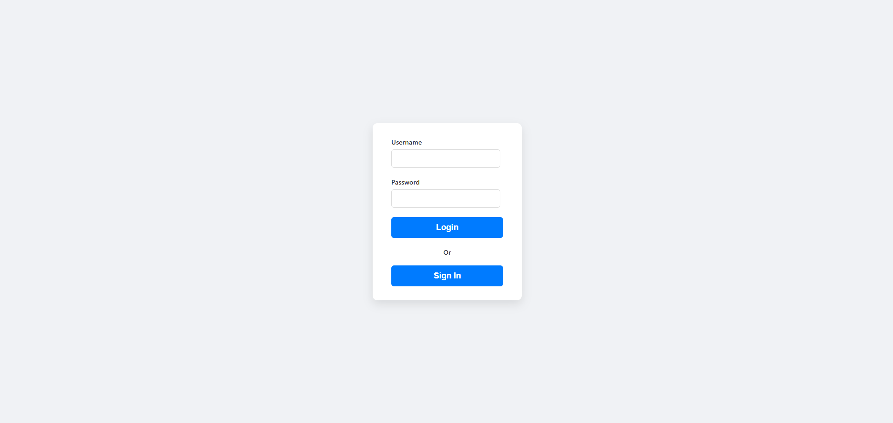
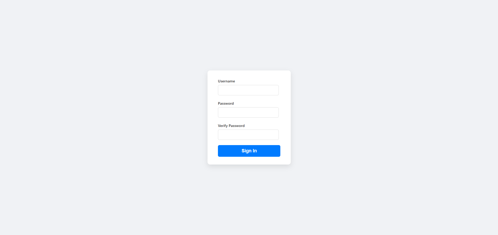
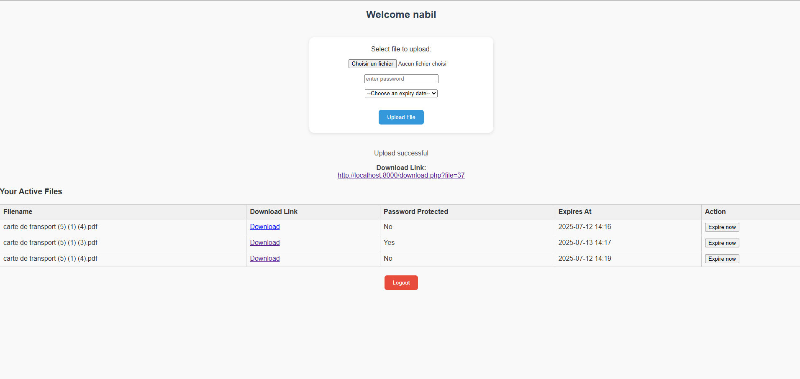
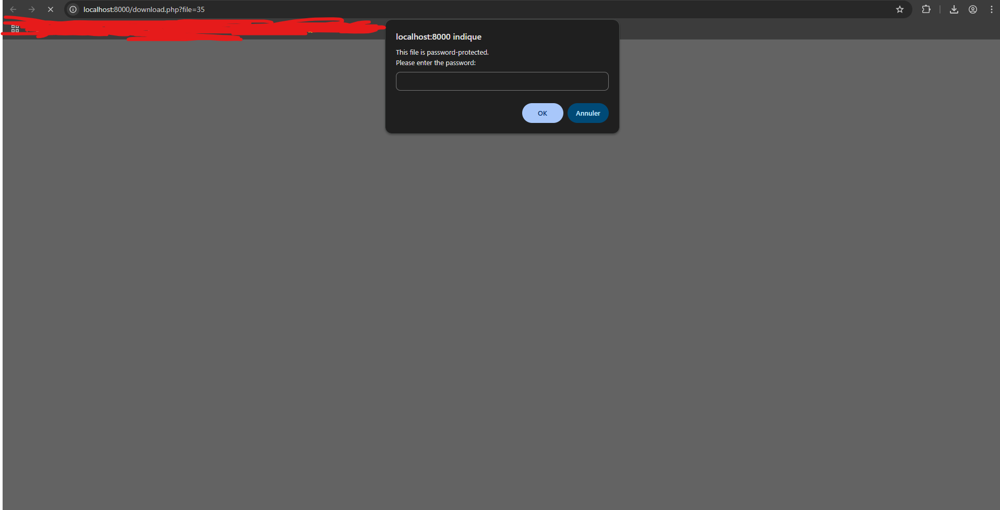
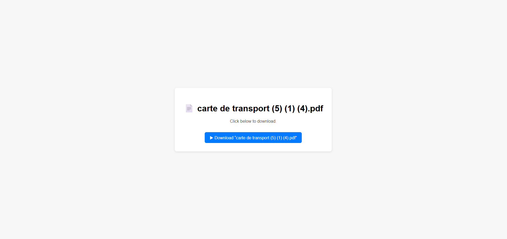

# secure-file-sharing

A simple, secure, and self-hosted file-sharing web application written in PHP + SQLite.
Supports user authentication, password-protected uploads, file expiry, and a clean user dashboard to manage files.

## Features
- User authentication with hashed passwords

- File uploads with:

        Password protection (optional)

        Expiry date (default 1 day)

        File type validation
        
        File size validation (< 10 MB)

- Download page with secure access:

        Password prompt if protected

        Expiration check

- SQLite database (easy to set up)

- Clean and responsive interface

- Written in plain PHP (no frameworks)

## Setup
### 1. Clone the Repository
```
git clone https://github.com/NabilAbdelouahed/secure-file-sharing.git
cd secure-file-sharing
```
### 2. Start the server
```
php -S localhost:8000
```

Then visit: http://localhost:8000







# Improvements

- To avoid abuse, log upload/download attempts and throttle per user/IP.

- Set max download number at upload

- Scan uploaded files for viruses/malware (using ClamAV for example which is free and open source)